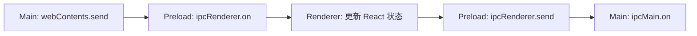

# 计数器的双向 IPC 实验

> **类型**: 实现记录
> **状态**: 已实现
> **作者**: shiyu.chen
> **创建日期**: 2026-10-04
> **最后更新**: 2026-10-07

## TL;DR

- 通过菜单加减数字，定位 Main → Preload → Renderer → Preload → Main 的往返链路。
- 页面调用桥接函数与跨进程发送消息是不同边界；页面只收到数值，不接收原始 IPC event。
- 历史手测已经观察过断点与数值变化；迁移后 Smoke Test 增加菜单计数与页面重载检查，不代替完整断点手测。

## 问题与资料

问题：点击菜单后，数字在哪里修改，Main 又是怎样收到新值的？先阅读 [官方 IPC 教程](https://www.electronjs.org/zh/docs/latest/tutorial/ipc)。环境、版本和本次测试结果见 [实验索引](README.md#验证基准)。

## 操作与定位

启动方式见 [项目 README](../../README.md)。从计数值 0 开始，点击 **Counter → Increment**；再点击 **Decrement**。本项目预期页面依次显示 1、0，启动终端收到对应新值。

| 顺序 | 文件与断点位置 | 观察内容 |
| --- | --- | --- |
| 1 | [main.js](../../main.js) 的 `sendCounterUpdate` 内 `webContents.send` | 目标窗口与增量 `value` |
| 2 | [preload.js](../../preload.js) 的 `onUpdateCounter` 回调内 `callback(value)` | 原始 event 留在 Preload，数值传给页面 |
| 3 | [renderer.js](../../renderer.js) 的 `handleUpdateCounter` | `oldValue`、`newValue` 与 `setValue()` 状态更新 |
| 4 | `preload.js` 的 `sendCounterValue` 内 `ipcRenderer.send` | 新计数值发送到 Main |
| 5 | `main.js` 的 `handleCounterValue` | Main 接收的新值 |

用 VS Code 的 **Main + renderer** 启动，点击文件行号左侧设置断点。每次点击调试工具栏的“继续”到下一处；完成后清理本轮断点并从应用菜单退出。

源码中的消息方向如下；Preload 与页面之间跨上下文，Preload 与 Main 之间使用 IPC。

## 结果与限制

学习时已手动停在 `handleUpdateCounter` 并观察到 `value = 1`，随后跟踪回传链路。此处是历史实践记录，不代表本轮重做了所有断点操作。

[启动测试](../../tests/electron.smoke.spec.js) 检查标题、初始计数和桥接 API 类型，并从 Main 调用菜单 click handler，验证计数变化及重载后不会重复累加。它没有模拟真实系统菜单点击，也没有断言 Main 收到回传的每个值。

2026-10-07 界面迁移后，`setValue()` 交给 React 更新 DOM；随后发出的 `counterValue()` 不代表 React 已完成 DOM 提交。Preload 的订阅返回取消函数，供 React effect 清理监听。断点仍设在命名函数中，Main 和 Preload 没有参与 Vite 打包。当前示例不代表完整的生产 IPC 权限设计。
