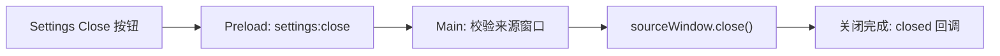

# 模态 Settings 的创建与关闭

> **类型**: 实现记录
> **状态**: 已实现
> **作者**: shiyu.chen
> **创建日期**: 2026-10-04
> **最后更新**: 2026-10-04

## TL;DR

- Settings 使用 `parent`、`modal: true`、`show: false` 创建，在 `ready-to-show` 时显示。
- Close 按钮通过 Preload 发 IPC，由 Main 校验来源窗口并请求关闭。
- 当前测试验证窗口关系与关闭；不据不同 webContents ID 推导操作系统 PID 一定不同。

## 问题与资料

问题：谁创建与关闭模态窗口？`close` 和 `closed` 时对象处于什么状态？参考 [BrowserWindow 官方 API](https://www.electronjs.org/zh/docs/latest/api/browser-window)。本次环境见 [实验索引](README.md#验证基准)。

## 操作与定位

1. 启动应用，点击 **Window → Open Settings**。macOS 中 Settings 作为模态窗口显示，页面提供 Close 按钮。
2. 在 [main.js](../../main.js) 的 `createSettingsWindow` 内观察配置和 `[windows] created` 输出。记录两个窗口及 webContents ID。
3. 若要调试设置页，保持窗口打开，在 VS Code 选择 **Renderer - Settings Window** 并点击绿色三角。它按 `settings.html` 的 URL 附加。
4. 在 [settings-renderer.js](../../settings-renderer.js) 的 `closeSettings()` 调用、[preload.js](../../preload.js) 的同名函数、Main 的 `handleCloseSettings` 和 `closed` 回调设置断点。
5. 点击 **Close**，观察 `event.sender` 对应哪个窗口、Main 如何检查身份，然后继续运行直到窗口消失。再次打开 Settings，可重复实验。

该关闭路径对应当前实现：

图中的关闭完成不是 `close()` 的同步返回保证；若后续逻辑依赖窗口已销毁，应观察 `closed`。

## 结果与限制

历史手测已经覆盖打开、关闭和多目标断点；[第二个 Smoke Test](../../tests/electron.smoke.spec.js) 断言两个窗口及 webContents ID 不同、父窗口 ID 正确、`isModal()` 为 true，点击 Close 后仅剩主窗口。最近运行结果统一见索引。

该测试没有验证父窗口主动退出时的跨平台关闭顺序，也没有读取 Renderer PID。`parent`、模态交互和进程分配应分别讨论。
