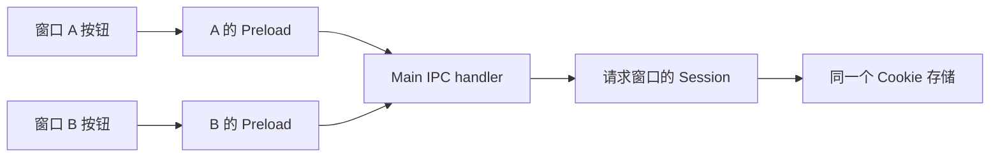

# Session 与窗口：共享 Cookie 实验

> **类型**: 实现记录
> **状态**: 已实现
> **作者**: shiyu.chen
> **创建日期**: 2026-10-06
> **最后更新**: 2026-10-06

## TL;DR

- 第一轮研究两个独立窗口是否能共享 Cookie；两个窗口都使用 `session-lab-shared` partition。
- 操作通过专用 Preload 请求 Main，Main 读取请求窗口自身的 `webContents.session`，没有在 JavaScript 变量中代存 Cookie。
- 本轮不验证重启持久化、真实网站登录或跨 partition 隔离；后续逐轮增加对照。

## 官方资料与实验边界

先阅读 [session.fromPartition](https://www.electronjs.org/zh/docs/latest/api/session#sessionfrompartitionpartition-options) 和 [Cookies](https://www.electronjs.org/docs/latest/api/cookies) 的 `get`、`set`、`remove`。
官方契约：同名 partition 复用 Session；本轮非空名称没有 `persist:` 前缀，使用内存 Session。这与未指定 partition 时使用默认持久 Session 不同。

两个实验窗口加载同一个本地 HTML。Main 使用 `https://session-lab.example/` 作为测试 Cookie 的 URL，不访问该网站、不使用真实账号、不修改默认 Session。此 URL 用于 Cookie 的域与路径匹配，不要求窗口先加载它；这不是 `document.cookie` 或实际 HTTP 携带 Cookie 的实验。

## 运行与观察

在项目根目录执行 `npm start`，或在 VS Code“运行和调试”中选择 `Main`，点击绿色三角启动。先关闭已有 Settings 模态窗口，再点应用顶部菜单 **Session → Open Shared Windows**。出现 Session A、Session B 后可拖动标题栏并排摆放；重复点菜单会复用尚未关闭的实验窗口。

按以下顺序操作，先预测再看结果：

1. A 点击“删除测试 Cookie”，B 点击“读取 Cookie”，两边应显示 `cookie: null`。
2. A 点击“写入测试 Cookie”，等按钮恢复可用，记下 `written-by-Session A-...`。
3. B 点击“读取 Cookie”，比较值是否与 A 完全一致。
4. 对比 `windowId`、`webContentsId` 是否不同，以及 `sameSessionAsPeer` 是否为 `true`。
5. B 点击“删除测试 Cookie”，等操作完成，再让 A 读取，应回到 `null`。

以上为预期，不代替用户实测记录。输出是每次操作的快照，不会因另一个窗口写入而自动更新；关闭其中一个窗口后，另一个窗口重新读取时 `sameSessionAsPeer` 为 `null`，表示无对照窗口，不是 Session 被清空。

点击红色关闭按钮关闭实验窗口；通过应用菜单 **Quit** 完整退出。创建/重开窗口不会自动写入或清空 Cookie，重复实验可用删除按钮重置测试数据。

## 代码与断点

| 文件 | 阅读重点与断点位置 |
| --- | --- |
| [session-lab.js](../../session-lab.js) | `openSessionWindows()` 中的 `webPreferences.partition`；`writeCookie()` 中的 `cookies.set()`；`readState()` 中的 `cookies.get()` 和 Session 对象比较 |
| [session-preload.js](../../session-preload.js) | 只暴露三个固定操作，不允许 Renderer 自选 IPC 通道、Cookie URL 或 partition |
| [session-renderer.js](../../session-renderer.js) | 按钮调用 `runAction()`，等待返回后更新当前窗口的结果 |
| [main.js](../../main.js) | 菜单入口，以及 `whenReady` 后一次性注册 IPC handler |

这轮先在 VS Code 调试 Main 即可：打开 `session-lab.js`，点击 `cookies.set()` / `cookies.get()` 对应行号左侧设置断点，再操作窗口按钮。暂停时查看 `win`、`ownSession`、`cookies`；`await cookies.get()` 执行前还没有返回结果，点调试工具栏“单步跳过”后再看。点“继续”让页面收到结果；不要在 Main 暂停期间等待按钮响应。

共享的是 Session，不是两个页面的 DOM 或 JS 变量。数据路径如下：

Main 校验调用方属于实验窗口且来自其顶层本地页面，再返回普通数据；Session 对象本身不暴露给 Renderer。

## 验证与下一轮

本轮代码于 2026-10-06 添加，开发态、macOS。用户于同日确认已完成第一轮手测；本次未新增逐步截图或日志。自动化检查状态在 [实验索引](README.md) 记录，测试入口为 [electron.smoke.spec.js](../../tests/electron.smoke.spec.js)。

后续第二轮只改变 B 的 partition，第三轮对照内存和持久 partition，并使用明确未来过期时间的 Cookie 检查完整退出重启。三轮完成后整理实测结论、更新学习进度，并提醒提交、推送 GitHub；本轮不自动执行 Git 写操作。
