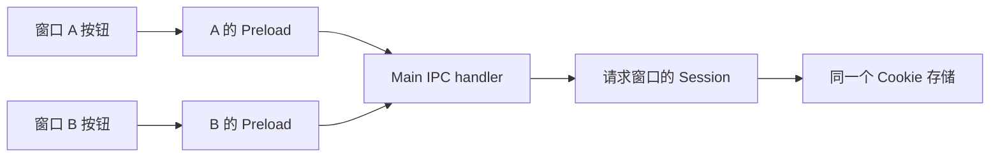

# Session 与窗口：Cookie 共享与隔离实验

> **类型**: 实现记录
> **状态**: 已实现
> **作者**: shiyu.chen
> **创建日期**: 2026-10-06
> **最后更新**: 2026-10-07

## TL;DR

- 第一轮使用同一个 partition 观察 Cookie 共享；第二轮只改变 B 的 partition，观察同名 Cookie 隔离。
- 操作通过专用 Preload 请求 Main，Main 读取请求窗口自身的 `webContents.session`，没有在 JavaScript 变量中代存 Cookie。
- 第一轮已手测；第二轮自动化通过，用户手测待完成。两轮均不验证重启持久化或真实网站登录。

## 官方资料与实验边界

先阅读 [session.fromPartition](https://www.electronjs.org/zh/docs/latest/api/session#sessionfrompartitionpartition-options) 和 [Cookies](https://www.electronjs.org/docs/latest/api/cookies) 的 `get`、`set`、`remove`。
官方契约：同名 partition 复用 Session；本轮非空名称没有 `persist:` 前缀，使用内存 Session。这与未指定 partition 时使用默认持久 Session 不同。

两个实验窗口加载同一个本地 HTML。Main 使用 `https://session-lab.example/` 作为测试 Cookie 的 URL，不访问该网站、不使用真实账号、不修改默认 Session。此 URL 用于 Cookie 的域与路径匹配，不要求窗口先加载它；这不是 `document.cookie` 或实际 HTTP 携带 Cookie 的实验。

## 运行与观察

在项目根目录执行 `npm start`，或在 VS Code“运行和调试”中选择 `Main`，点击绿色三角启动。主窗口自动最大化，但不进入 macOS 独立全屏空间。先关闭已有 Settings 模态窗口。Session A、B 自动左右排列；重复选择同一模式会复用窗口并重新排齐。

排列区域取自当前聚焦窗口所在显示器的 `workArea`；无聚焦窗口时使用鼠标所在显示器。外边距为 16 DIP、窗口间距为 12 DIP，避开菜单栏和 Dock。页面使用共享 Tailwind 主题与 shadcn/ui 组件，Vite 输出到 `dist/renderer/`；不改变 Cookie 和 IPC 语义。

页面上半部分展示 partition、窗口与 webContents ID、存储类型、共享关系和 Cookie 值；“原始 JSON”可展开检查同一份返回数据。操作状态中的时间是当前 Renderer 收到成功结果的本地时间，不是 Cookie 的过期时间或服务端时间。另一窗口的写入不会自动刷新本窗口，需要主动点击“读取 Cookie”。

请求期间三个按钮暂时禁用；失败时显示错误并恢复按钮，已有成功快照不会被清空，但会明确标为上一次结果。关闭对照窗口后重新读取，共享关系显示“无对照窗口”，不表示 Cookie 被删除。页面中的“先预测，再观察”只列实验预期，不自动宣布实验通过。

### 第一轮：共享

点应用顶部菜单 **Session → Open Shared Windows**。

按以下顺序操作，先预测再看结果：

1. A 点击“删除测试 Cookie”，B 点击“读取 Cookie”，两边应显示 `cookie: null`。
2. A 点击“写入测试 Cookie”，等按钮恢复可用，记下 `written-by-Session A-...`。
3. B 点击“读取 Cookie”，比较值是否与 A 完全一致。
4. 对比 `windowId`、`webContentsId` 是否不同，以及 `sameSessionAsPeer` 是否为 `true`。
5. B 点击“删除测试 Cookie”，等操作完成，再让 A 读取，应回到 `null`。

以上为预期，不代替用户实测记录。输出是每次操作的快照，不会因另一个窗口写入而自动更新；关闭其中一个窗口后，另一个窗口重新读取时 `sameSessionAsPeer` 为 `null`，表示无对照窗口，不是 Session 被清空。

点击红色关闭按钮关闭实验窗口；通过应用菜单 **Quit** 完整退出。创建/重开窗口不会自动写入或清空 Cookie，重复实验可用删除按钮重置测试数据。

### 第二轮：隔离

先关闭 A、B 两个实验窗口，再点 **Session → Open Isolated Windows**。如果旧模式窗口还在，程序只提示先关闭，不会偷偷替换窗口或清空 Cookie。两个模式使用相同 HTML、Preload、IPC、Cookie URL 和名称；只改变 B 的 partition：

| 模式 | A 的 partition | B 的 partition | Session 比较预期 |
| --- | --- | --- | --- |
| shared | `session-lab-shared` | `session-lab-shared` | `true` |
| isolated | `session-lab-shared` | `session-lab-isolated-b` | `false` |

1. A、B **分别**点击“删除测试 Cookie”，等待操作完成，确认两边为 `null`。A 沿用第一轮的 Session，可能还保留先前写入值；切换模式不是清空数据。
2. A 写入，记下值；B 读取，预期仍为 `null`。
3. B 写入，记下自己的值；A 再读取，预期仍为 A 的原值。
4. A 删除，再让 B 读取，预期 B 的值仍在。
5. 对比 `partition` 和 `sameSessionAsPeer`：前者不同，后者为 `false`。

预期解释：相同 Cookie URL/名称分别存入两个 Session，不再共享；不是换了 HTML，也不是 Main 按窗口分支伪造读写结果。用户手测结果待补记。

## 代码与断点

| 文件 | 阅读重点与断点位置 |
| --- | --- |
| [session-lab.js](../../session-lab.js) | `openSessionWindows()` 中的 `webPreferences.partition`；`writeCookie()` 中的 `cookies.set()`；`readState()` 中的 `cookies.get()` 和 Session 对象比较 |
| [session-preload.js](../../session-preload.js) | 只暴露三个固定操作，不允许 Renderer 自选 IPC 通道、Cookie URL 或 partition |
| [session-renderer.js](../../session-renderer.js) | 按钮调用 `runAction()`，等待返回后更新当前窗口的结果 |
| [ui/session-page.jsx](../../ui/session-page.jsx) | 将同一份返回数据展示为状态摘要、操作反馈和可展开 JSON；不自行读写 Cookie |
| [main.js](../../main.js) | 菜单入口，以及 `whenReady` 后一次性注册 IPC handler |

第二轮先看 `session-lab.js` 顶部 `partitions` 配置，再看创建窗口时的 `partition: partitions[mode][label]`。`mode`、`partition`、`sameSessionAsPeer` 都是实验输出字段：前两个来自 Main 保存的配置，后者通过比较两个 `webContents.session` 对象计算，不是 Electron 自带的三个属性。

这轮先在 VS Code 调试 Main 即可：打开 `session-lab.js`，点击 `cookies.set()` / `cookies.get()` 对应行号左侧设置断点，再操作窗口按钮。暂停时查看 `win`、`ownSession`、`cookies`；`await cookies.get()` 执行前还没有返回结果，点调试工具栏“单步跳过”后再看。点“继续”让页面收到结果；不要在 Main 暂停期间等待按钮响应。

共享模式共享的是 Session，不是两个页面的 DOM 或 JS 变量。第一轮的数据路径如下；第二轮 Main 按请求窗口拿到不同的 Session：

Main 校验调用方属于实验窗口且来自其顶层本地页面，再返回普通数据；Session 对象本身不暴露给 Renderer。

## 验证与下一轮

第一轮代码于 2026-10-06 添加，开发态、macOS。用户于同日确认已完成第一轮手测；本次未新增逐步截图或日志。第一轮基线提交为 `2c3b01f`，第二轮及原生 CSS 界面基线为 `d1f9c77`。自动化检查状态在 [实验索引](README.md) 记录，测试入口为 [electron.smoke.spec.js](../../tests/electron.smoke.spec.js)。

第二轮于同日通过自动化对照：B 读不到 A 的 Cookie、两侧写入互不覆盖、A 删除不影响 B；用户手测待完成。第三轮尚未实现，将对照内存和持久 partition，并使用明确未来过期时间的 Cookie 检查完整退出重启。三轮完成后整理实测结论、更新学习进度，并提醒提交、推送 GitHub。
